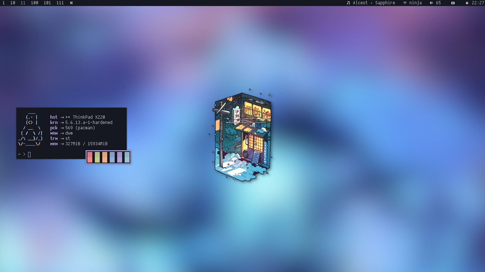
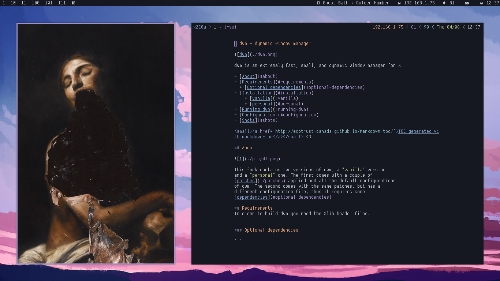

# dwm - dynamic window manager


dwm is an extremely fast, small, and dynamic window manager for X.

- [About](#about)
- [Requirements](#requirements)
  * [Optional dependencies](#optional-dependencies)
- [Installation](#installation)
    + [vanilla](#vanilla)
    + [personal](#personal)
- [Running dwm](#running-dwm)
- [Configuration](#configuration)
- [Shots](#shots)

<small><a href='http://ecotrust-canada.github.io/markdown-toc/'>TOC generated with markdown-toc</a></small> <3

## About


This fork contains two versions of dwm, a __"vanilla"__ version
and a __"personal"__ one. The first comes with a couple of 
[patches](./patches) applied and all the default configurations
of dwm. The second comes with the same patches, but has a
different configuration file, thus it requires some
[dependencies](#optional-dependencies).

## Requirements
In order to build dwm you need the Xlib header files.


### Optional dependencies

```
    siji-font dina-font terminus-font playerctl alsamixer alsa-utils nnn
    scrot slock tabbed st surf dmenu
```

> You can build `slock tabbed st surf dmenu`, check
  [suckless](https://suckless.org) website. `siji-font` is available in the
  [AUR](https://aur.archlinux.org/packages/siji-git).

## Installation
Clone and edit `config.mk` to match your local setup (dwm is installed into
the `/usr/local` namespace by default).

#### vanilla

Enter the following commands to build and install dwm (if necessary as root):

```sh
rm config.h
make clean install
```

#### personal

Run the next line to build and install dwm with my personal configuration
(if necessary as root):

```sh
make && make install
```

> Check the optional [dependencies](#optional-dependencies) in order
  to have the setup functionalities.

## Running dwm

Add the following line to your `.xinitrc` to start dwm using `startx`:

```
    exec dwm
```

In order to connect dwm to a specific display, make sure that
the DISPLAY environment variable is set correctly, e.g.:

```
    DISPLAY=foo.bar:1 exec dwm
```

(This will start dwm on display :1 of the host foo.bar.)

In order to display status info in the bar, you can do something
like this in your `.xinitrc`:

```sh
    while xsetroot -name "`date` `uptime | sed 's/.*,//'`"
    do
    	sleep 1
    done &
    exec dwm
```

Or create a custom script and execute it in `.xinitrc`.


## Configuration
The configuration of dwm is done by creating a custom config.h
and (re)compiling the source code. (:

## Shots

Single focused window



Fake busy


Grid


